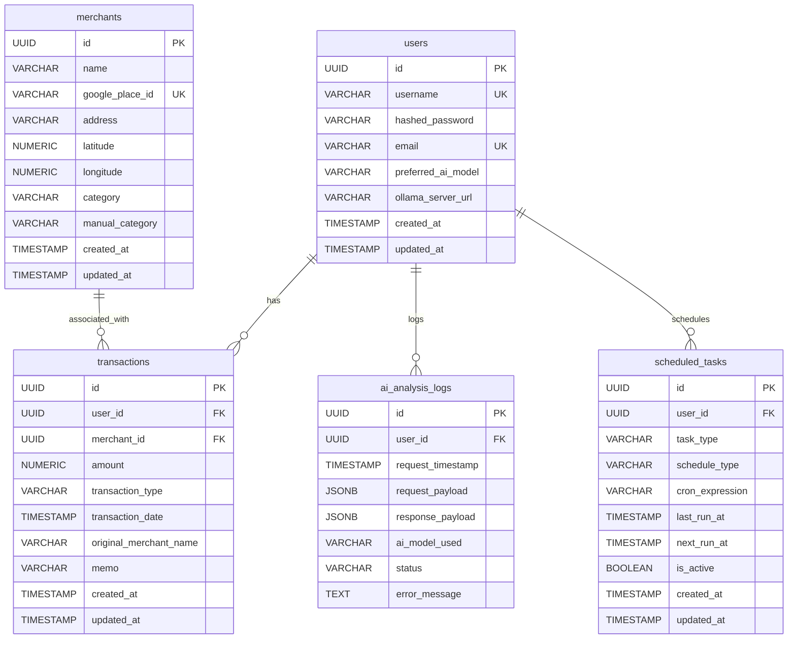

# AI 인공지능 가계부 시스템 데이터베이스 설계

## 1. 개요

본 문서는 AI 인공지능 가계부 시스템의 데이터베이스 스키마를 정의합니다. 시스템의 핵심 데이터를 저장하고 관리하기 위한 엔티티, 속성, 관계 및 제약 조건을 명시합니다. PostgreSQL을 기반으로 설계하며, 확장성, 무결성, 보안을 고려합니다.

## 2. 주요 엔티티 및 속성 정의

시스템 요구사항에 따라 다음과 같은 주요 엔티티를 정의합니다.

### 2.1. `users` 테이블

사용자 정보를 저장합니다. JWT 인증 및 AI 설정 관리에 사용됩니다.

| 컬럼명 | 데이터 타입 | 제약 조건 | 설명 |
|---|---|---|---|
| `id` | `UUID` | `PRIMARY KEY`, `DEFAULT gen_random_uuid()` | 사용자 고유 식별자 |
| `username` | `VARCHAR(255)` | `NOT NULL`, `UNIQUE` | 사용자 로그인 아이디 |
| `hashed_password` | `VARCHAR(255)` | `NOT NULL` | 해싱된 비밀번호 |
| `email` | `VARCHAR(255)` | `NOT NULL`, `UNIQUE` | 사용자 이메일 주소 |
| `preferred_ai_model` | `VARCHAR(50)` | `DEFAULT 'gemini'` | 선호하는 AI 모델 (gemini, ollama, hybrid) |
| `ollama_server_url` | `VARCHAR(255)` | `NULLABLE` | Ollama 서버 URL (로컬 모드 시) |
| `created_at` | `TIMESTAMP WITH TIME ZONE` | `NOT NULL`, `DEFAULT now()` | 사용자 생성 일시 |
| `updated_at` | `TIMESTAMP WITH TIME ZONE` | `NOT NULL`, `DEFAULT now()` | 사용자 정보 마지막 업데이트 일시 |

### 2.2. `merchants` 테이블

가맹점 정보를 저장합니다. Google Places API를 통해 보강된 정보를 포함합니다.

| 컬럼명 | 데이터 타입 | 제약 조건 | 설명 |
|---|---|---|---|
| `id` | `UUID` | `PRIMARY KEY`, `DEFAULT gen_random_uuid()` | 가맹점 고유 식별자 |
| `name` | `VARCHAR(255)` | `NOT NULL` | 가맹점명 (우리은행 API 원본) |
| `google_place_id` | `VARCHAR(255)` | `UNIQUE`, `NULLABLE` | Google Places API Place ID |
| `address` | `VARCHAR(500)` | `NULLABLE` | 상세 주소 |
| `latitude` | `NUMERIC(10, 7)` | `NULLABLE` | 위도 |
| `longitude` | `NUMERIC(10, 7)` | `NULLABLE` | 경도 |
| `category` | `VARCHAR(255)` | `NULLABLE` | Google Places 카테고리 (예: 'Restaurant', 'Cafe') |
| `manual_category` | `VARCHAR(255)` | `NULLABLE` | AI/룰 기반 또는 사용자 지정 카테고리 (예: '식비', '교통') |
| `created_at` | `TIMESTAMP WITH TIME ZONE` | `NOT NULL`, `DEFAULT now()` | 가맹점 정보 생성 일시 |
| `updated_at` | `TIMESTAMP WITH TIME ZONE` | `NOT NULL`, `DEFAULT now()` | 가맹점 정보 마지막 업데이트 일시 |

### 2.3. `transactions` 테이블

사용자의 체크카드 거래 내역 및 현금 이체 내역을 저장합니다.

| 컬럼명 | 데이터 타입 | 제약 조건 | 설명 |
|---|---|---|---|
| `id` | `UUID` | `PRIMARY KEY`, `DEFAULT gen_random_uuid()` | 거래 내역 고유 식별자 |
| `user_id` | `UUID` | `NOT NULL`, `FOREIGN KEY REFERENCES users(id)` | 사용자 ID |
| `merchant_id` | `UUID` | `NULLABLE`, `FOREIGN KEY REFERENCES merchants(id)` | 가맹점 ID (현금 이체 시 NULL) |
| `amount` | `NUMERIC(15, 2)` | `NOT NULL` | 거래 금액 |
| `transaction_type` | `VARCHAR(50)` | `NOT NULL` | 거래 유형 (예: '결제', '입금', '출금', '이체') |
| `transaction_date` | `TIMESTAMP WITH TIME ZONE` | `NOT NULL` | 거래 발생 일시 |
| `original_merchant_name` | `VARCHAR(255)` | `NOT NULL` | 우리은행 API에서 제공하는 원본 가맹점명 |
| `memo` | `VARCHAR(500)` | `NULLABLE` | 현금 이체 시 메모 또는 상대방명 |
| `created_at` | `TIMESTAMP WITH TIME ZONE` | `NOT NULL`, `DEFAULT now()` | 거래 내역 생성 일시 |
| `updated_at` | `TIMESTAMP WITH TIME ZONE` | `NOT NULL`, `DEFAULT now()` | 거래 내역 마지막 업데이트 일시 |

### 2.4. `ai_analysis_logs` 테이블

AI 분석 요청 및 응답 로그를 저장합니다. 사용자별 로그 기록 요구사항을 충족합니다.

| 컬럼명 | 데이터 타입 | 제약 조건 | 설명 |
|---|---|---|---|
| `id` | `UUID` | `PRIMARY KEY`, `DEFAULT gen_random_uuid()` | 로그 고유 식별자 |
| `user_id` | `UUID` | `NOT NULL`, `FOREIGN KEY REFERENCES users(id)` | 사용자 ID |
| `request_timestamp` | `TIMESTAMP WITH TIME ZONE` | `NOT NULL`, `DEFAULT now()` | AI 분석 요청 일시 |
| `request_payload` | `JSONB` | `NOT NULL` | AI 분석 요청 데이터 (거래 내역 등) |
| `response_payload` | `JSONB` | `NOT NULL` | AI 분석 응답 데이터 (분석 리포트 등) |
| `ai_model_used` | `VARCHAR(50)` | `NOT NULL` | 사용된 AI 모델 (Gemini, Ollama) |
| `status` | `VARCHAR(50)` | `NOT NULL` | 분석 상태 (성공, 실패 등) |
| `error_message` | `TEXT` | `NULLABLE` | 오류 발생 시 메시지 |

### 2.5. `scheduled_tasks` 테이블

자동 스케줄링 설정 정보를 저장합니다.

| 컬럼명 | 데이터 타입 | 제약 조건 | 설명 |
|---|---|---|---|
| `id` | `UUID` | `PRIMARY KEY`, `DEFAULT gen_random_uuid()` | 스케줄 고유 식별자 |
| `user_id` | `UUID` | `NOT NULL`, `FOREIGN KEY REFERENCES users(id)` | 사용자 ID |
| `task_type` | `VARCHAR(50)` | `NOT NULL` | 작업 유형 (예: 'transaction_sync', 'ai_report_generation') |
| `schedule_type` | `VARCHAR(50)` | `NOT NULL` | 스케줄 유형 (예: 'daily', 'weekly', 'monthly', 'cron') |
| `cron_expression` | `VARCHAR(255)` | `NULLABLE` | Cron 표현식 (cron 스케줄 시) |
| `last_run_at` | `TIMESTAMP WITH TIME ZONE` | `NULLABLE` | 마지막 실행 일시 |
| `next_run_at` | `TIMESTAMP WITH TIME ZONE` | `NULLABLE` | 다음 실행 예정 일시 |
| `is_active` | `BOOLEAN` | `NOT NULL`, `DEFAULT TRUE` | 스케줄 활성화 여부 |
| `created_at` | `TIMESTAMP WITH TIME ZONE` | `NOT NULL`, `DEFAULT now()` | 스케줄 생성 일시 |
| `updated_at` | `TIMESTAMP WITH TIME ZONE` | `NOT NULL`, `DEFAULT now()` | 스케줄 마지막 업데이트 일시 |

## 3. 엔티티 관계 (ERD)

다음은 위에서 정의된 엔티티 간의 관계를 나타내는 ERD입니다.

## 4. 데이터 타입, 제약 조건 및 인덱싱 고려사항

- **UUID**: 모든 `id` 필드는 UUID를 사용하여 전역적으로 고유한 식별자를 보장합니다. 이는 분산 환경에서의 데이터 병합 및 충돌 방지에 유리합니다.
- **`VARCHAR` 길이**: 문자열 길이는 예상되는 최대 길이를 고려하여 충분히 할당했습니다. 필요에 따라 더 세밀하게 조정할 수 있습니다.
- **`NUMERIC`**: 금액 및 위도/경도와 같은 정밀한 숫자는 `NUMERIC` 타입을 사용하여 정확성을 보장합니다.
- **`TIMESTAMP WITH TIME ZONE`**: 모든 시간 관련 필드는 타임존 정보를 포함하여 저장하여 전역적인 시간 일관성을 유지합니다.
- **`NOT NULL`**: 필수 필드에는 `NOT NULL` 제약 조건을 적용하여 데이터 무결성을 확보합니다.
- **`UNIQUE`**: `username`, `email`, `google_place_id`와 같이 고유해야 하는 필드에는 `UNIQUE` 제약 조건을 적용합니다.
- **`FOREIGN KEY`**: 엔티티 간의 관계를 명확히 하고 데이터 참조 무결성을 유지하기 위해 외래 키 제약 조건을 설정합니다.
- **인덱싱**: `user_id`, `merchant_id`, `transaction_date` 등 자주 조회되거나 조인에 사용되는 컬럼에는 인덱스를 생성하여 쿼리 성능을 최적화할 예정입니다. 특히 `transactions` 테이블의 `user_id`와 `transaction_date`는 분석 및 검색에 핵심적인 역할을 하므로 복합 인덱스를 고려할 수 있습니다.
- **`JSONB`**: `ai_analysis_logs` 테이블의 `request_payload`와 `response_payload`는 유연한 스키마를 가지는 JSON 데이터를 효율적으로 저장하고 쿼리하기 위해 `JSONB` 타입을 사용합니다.

## 5. 데이터베이스 스키마 마이그레이션

데이터베이스 스키마 변경 사항을 관리하기 위해 Alembic과 같은 데이터베이스 마이그레이션 도구를 사용할 예정입니다. 이를 통해 개발 및 배포 과정에서 스키마 변경을 안전하고 효율적으로 적용할 수 있습니다.

## 6. 보안 고려사항

- **데이터 암호화**: `transactions` 테이블의 `amount`, `original_merchant_name`, `memo` 등 민감한 거래 정보는 애플리케이션 레벨에서 암호화하여 저장하는 것을 고려합니다. `users` 테이블의 `hashed_password`는 bcrypt와 같은 강력한 해싱 알고리즘을 사용하여 저장합니다.
- **접근 제어**: 데이터베이스 사용자 권한을 최소한으로 부여하고, 애플리케이션은 필요한 권한만 가진 데이터베이스 계정을 통해 접근하도록 설정합니다.
- **SQL 인젝션 방지**: ORM을 사용하여 SQL 쿼리를 생성함으로써 SQL 인젝션 공격을 방지합니다.

## 7. 결론

본 데이터베이스 설계는 AI 인공지능 가계부 시스템의 핵심 데이터 요구사항을 충족하며, 확장성, 무결성, 보안을 고려하여 안정적인 데이터 관리를 목표로 합니다. 정의된 스키마를 기반으로 백엔드 개발을 진행할 예정입니다.

